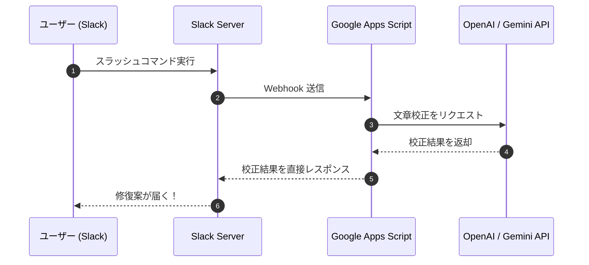
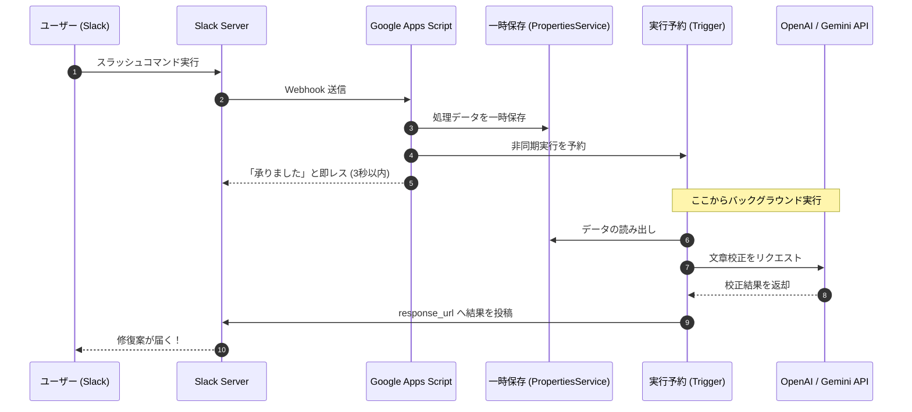

# 【演習課題案】Slack × AI 文章校正アシスタントの構築

## 1. プロジェクト概要
Slack 上で動作する、AI を活用した文章校正ツールを開発します。
ユーザーが Slack から特定のコマンドを実行すると、入力用フォーム（モーダル）が表示され、校正したい文章と希望するトーンを選択できる仕組みです。

## 2. 解決したい課題
- **コミュニケーションコストの削減**: メールの返信やチャットでの丁寧な言い回しを考える時間を短縮する。
- **プラットフォームの制約回避**: Slack の「3秒応答ルール」という技術的な制約を、アーキテクチャの工夫で解決する。

## 3. システムアーキテクチャ（図解：本来あるべき姿 vs 非同期）

### A. 【もし 3秒ルールがなかったら】シンプルな同期処理
制約がない場合の「正規ルート」です。非常にシンプルですが、AI の処理を待っている間 Slack が固まってしまいます。

### B. 【現実：3秒ルールがある場合】非同期処理
今回の演習での正解ルートです。データの「一時保存」と「実行予約」を駆使します。

## 4. 学習のポイント（主要な実装項目）
生徒さんが自力で解決すべき技術的要素です。

1.  **Slack App 設定**: Webhook の受け口（Request URL）の作成と設定。
2.  **UI コンポーネントの構築**: Slack Block Kit を使用したモーダルの設計。
3.  **非同期処理の実装**: 
    - GAS の [doPost](file:///Users/yoshitomi/.gemini/antigravity/brain/a2632b50-805e-4171-bbd6-efa28d751561/Code.gs#1-80) 内で処理を完結させず、トリガー機能を使って後続の重い処理（AI呼び出し）を逃がす設計。
4.  **LLM API 連携**: 
    - ユーザーの選択した「トーン」をプロンプトに組み込み、最適な文章を生成させる。
5.  **認証とセキュリティ**: API キーの安全な管理（ScriptProperties の利用）。

## 5. 発展課題（ヒント）
- **多言語対応**: 入力言語を自動判別し、翻訳も同時に行う。
- **履歴機能**: 過去にどのような校正を行ったかをスプレッドシートに記録する。
- **Slack ショートカット連携**: 特定のメッセージを右クリックして校正に回す機能の追加。
