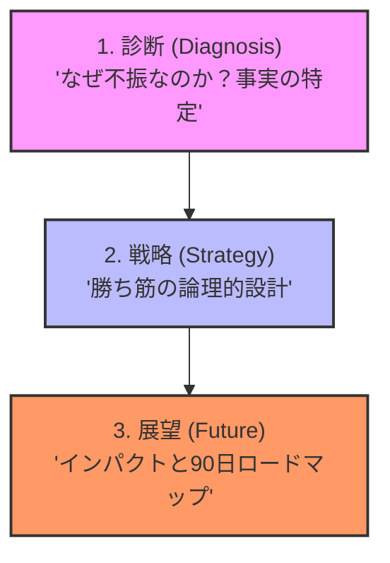

# Project Navigator: Marketing Strategy Framework

このドキュメントは、今回再構築を行った**「マーケティング戦略の抜本的再構成」**のプロジェクト全容を、第三者に効果的に伝えるための「司令塔」です。

各プロセス（1〜3）をクリックすることで、そのステップを実行・証明するための具体的な成果物（補足資料）へアクセスできます。

---

## 🧭 プロジェクトの全体像（ストーリー）

---

## 1. 診断：事実と課題の特定 (Diagnosis)
**「現在の不振はプロダクトの質ではなく、ターゲットと売り方のズレにある」**

戦略の出発点として、現状の「痛み」を定義し、なぜ今のままではいけないのかを明確にしています。

> [!TIP]
> **成果物 / So What?**
> - [初期提案 V1（現場の痛み）](./strategy/v1_pain_points.md)
>     - **意味**: 「専門用語」ではなく「現場の数字」で上司・組織の合意を勝ち取るためのドアオープナー。

---

## 2. 戦略：勝ち筋の設計 (Strategy)
**「DXを売るのをやめ、現場の時短（ベネフィット）を売る」**

実績あるベストプラクティスを元に、OGSMやAISCEASなどのフレームワークを用いて、論理的に「勝てる構造」を再設計しました。

> [!TIP]
> **成果物 / So What?**
> - [戦略提言 V2（本編）](./strategy/v2_main_strategy.md)
>     - **意味**: 意思決定会議において、反論の余地を与えないロジックの「大黒柱」。
> - [マーケティング・マスター・ナレッジベース](./strategy/master_knowledge.md)
>     - **意味**: 4P/4C変換やバーター戦略など、迷った時に立ち返るべき「思考の聖典」。

---

## 3. 展望：インパクトとロードマップ (Future)
**「承認後の90日間で、組織をどう変えるか」**

最後に、これらの実行結果がもたらす組織的なインパクトと、今後の具体的なスケジュールを提示します。

> [!TIP]
> **成果物 / So What?**
> - [プレゼン支援資料 V3（ロードマップ）](./strategy/v3_roadmap.md)
>     - **意味**: 承認を得るための「トドメ」の資料。FAQや90日間ロードマップで、実行への不安を一掃する。

---

## 📗 補足資料：プロセス最適化の根拠
今回の3ステップ構成が、なぜ従来のマーケティング・プロセスよりも優れているのか、その背景にある「最適化の論理」を解説しています。

- [プロセス比較・最適化レポート（以前のアプローチとの対比）](./methodology/process_comparison.md)
    - **意味**: 従来の「プロセス重視」から「結果重視」への転換を論理的に説明し、手法の正当性を担保する。

---

[Topに戻る](#project-navigator-marketing-strategy-framework) | 各資料の詳細が必要な場合は、リンク先をご参照ください。
